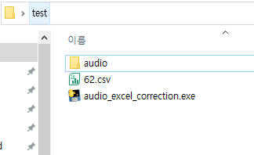
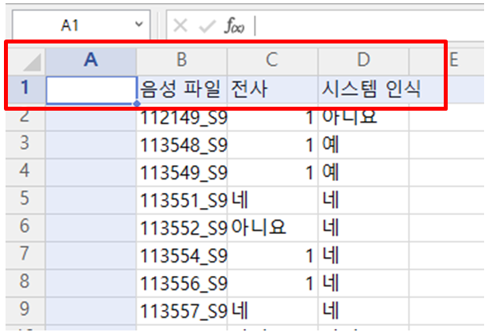
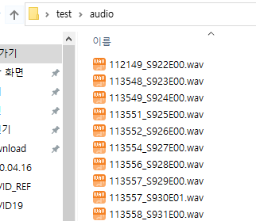
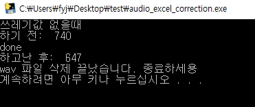

# 기능설명

#### 엑셀의 `C2열`에 `1`이 있으면, 해당 행의 오디오파일(.wav)을 `audio` 폴더에서 삭제합니다

- 준비물(단일 폴더 내에 있어야 합니다 )
  - 바탕화면의 하나의 폴더 안에(폴더명 상관 없음) 아래의 3가지 파일,폴더 가 있어야 한다
  -  `audio` **폴더** /  `.csv` **파일**  /  `audio_excel_correction.exe`
  -  

---

#### 순서

- 추가(2020.04.20)
- *A열이 있어도 되고 없어도 됩니다

1. 음성 파일(B1), 전사(C1), 시스템인식(D1)의 포멧으로 전수작업

   *B1, C1, D1 의 위치가 중요함. "음성파일" 의 이름은 아무거나 적어도 상관없음

2. 전사(C1)열에 삭제해야 할 파일(.wav)을 `1` 로 지정 

3. 전수작업 끝난 파일을 `.csv` **파일**로 만들기
   
- *.xlsx 파일의 첫 번째 sheet만 csv파일로 저장됩니다
  
- `.csv` 파일 예시

    
4. 음성파일이 있는 폴더이름 설정 > `audio`

    - `audio` 폴더 예시

      

5. `audio_excel_correction.exe` 실행

6. `.csv` 파일의 전사(C1)에  `1`이 있는 행에서 음성 파일(B1)의 이름을 추출한 뒤,
    `audio` 폴더내의 이름과 일치하는 `.wav` 파일을 삭제합니다.

    - 결과예시

      

---

### 주의

- `.csv`에서 **행 삭제**는 헤더에 필터 넣어서 전사(C1)를 `1` 로 설정 후, **직접** 삭제하세요. 
- 개수 비교도 직접 하셔야 합니다.
- `audio` **폴더** 에 `.txt` 가 있어도 상관없습니다. 나중에 개수 확인하실 때 지우시면 됩니다.